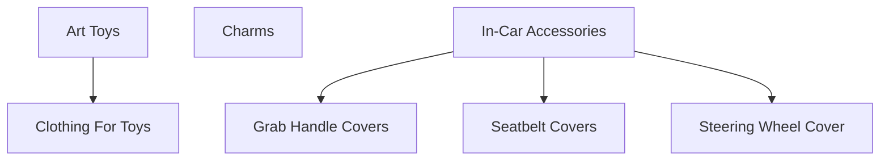

# Medusa 产品组织结构指南：Collections vs Categories vs Product Types

## 概念区别

### 1. Product Categories（产品类别）
- **用途**：按产品类型或主题组织产品，创建层级结构
- **特点**：
  - 支持嵌套层级结构（父类别-子类别）
  - 一个产品可以属于多个类别
  - 主要用于客户浏览和导航
  - 在前端显示为分类导航

### 2. Product Collections（产品集合）
- **用途**：按共同主题或目的组织产品
- **特点**：
  - 不支持嵌套结构（扁平结构）
  - 一个产品只能属于一个集合
  - 主要用于营销和主题展示
  - 常用于季节性、促销或主题性分组

### 3. Product Types（产品类型）
- **用途**：按产品的一般类型分组
- **特点**：
  - 扁平结构，不支持嵌套
  - 主要用于内部管理和系统区分
  - 如：Physical（实体）、Digital（数字）等
  - 更多是技术属性而非展示属性

## 您的产品类别结构建议

基于您的产品结构，建议如下组织方式：

### 方案一：使用 Categories（推荐）



#### 实施步骤：

1. **创建主类别**：
   - Art Toys
   - Charms  
   - In-Car Accessories

2. **创建子类别**：
   - 在 Art Toys 下创建 Clothing For Toys
   - 在 In-Car Accessories 下创建：
     - Grab Handle Covers
     - Seatbelt Covers
     - Steering Wheel Cover

### 方案二：混合使用 Categories + Collections

#### Categories 用于主要分类：
- Art Toys
- Charms
- In-Car Accessories

#### Collections 用于主题分组：
- "New Arrivals"（新品）
- "Best Sellers"（热销）
- "Seasonal Specials"（季节特惠）

### 方案三：使用 Product Types

创建以下 Product Types：
- Art Toy
- Charm
- Car Accessory

## API 创建示例

### 创建 Categories 的 API 调用

```javascript
// 创建主类别
const mainCategories = [
  {
    name: "Art Toys",
    handle: "art-toys",
    is_active: true,
    is_internal: false,
    description: "艺术玩具类别"
  },
  {
    name: "Charms", 
    handle: "charms",
    is_active: true,
    is_internal: false,
    description: "装饰品类别"
  },
  {
    name: "In-Car Accessories",
    handle: "in-car-accessories", 
    is_active: true,
    is_internal: false,
    description: "车内配件类别"
  }
];

// 创建子类别
const subCategories = [
  {
    name: "Clothing For Toys",
    handle: "clothing-for-toys",
    parent_category_id: "art-toys-id", // 需要先获取主类别ID
    is_active: true,
    is_internal: false,
    description: "玩具服装"
  },
  {
    name: "Grab Handle Covers",
    handle: "grab-handle-covers",
    parent_category_id: "in-car-accessories-id",
    is_active: true,
    is_internal: false,
    description: "把手套"
  },
  {
    name: "Seatbelt Covers", 
    handle: "seatbelt-covers",
    parent_category_id: "in-car-accessories-id",
    is_active: true,
    is_internal: false,
    description: "安全带套"
  },
  {
    name: "Steering Wheel Cover",
    handle: "steering-wheel-cover", 
    parent_category_id: "in-car-accessories-id",
    is_active: true,
    is_internal: false,
    description: "方向盘套"
  }
];
```

### 创建 Collections 的 API 调用

```javascript
const collections = [
  {
    title: "Art Toys Collection",
    handle: "art-toys-collection",
    description: "精选艺术玩具系列"
  },
  {
    title: "Charms Collection", 
    handle: "charms-collection",
    description: "精美装饰品系列"
  },
  {
    title: "Car Accessories Collection",
    handle: "car-accessories-collection", 
    description: "实用车内配件系列"
  }
];
```

### 创建 Product Types 的 API 调用

```javascript
const productTypes = [
  {
    value: "Art Toy",
    metadata: {
      description: "艺术玩具类型",
      category: "art-toys"
    }
  },
  {
    value: "Charm",
    metadata: {
      description: "装饰品类型", 
      category: "charms"
    }
  },
  {
    value: "Car Accessory",
    metadata: {
      description: "汽车配件类型",
      category: "in-car-accessories"
    }
  }
];
```

## 前端对应关系

### Categories 在前端：
- 显示为导航菜单
- 支持多级展开/折叠
- 用于分类浏览页面
- URL 结构：`/categories/art-toys`

### Collections 在前端：
- 显示为主题展示区
- 用于首页专题展示
- 用于营销活动页面
- URL 结构：`/collections/art-toys-collection`

### Product Types 在前端：
- 主要用于筛选功能
- 用于高级搜索
- 用于产品属性展示
- 通常不在主导航中显示

## 推荐实施策略

### 第一阶段：基础结构
1. **使用 Categories 创建主要分类结构**
2. **创建基础 Product Types**
3. **暂时不创建 Collections**（后续需要时再添加）

### 第二阶段：功能增强
1. **添加 Collections 用于营销**
2. **完善 Categories 的 SEO 优化**
3. **添加产品标签系统**

### 第三阶段：高级功能
1. **实现智能推荐**
2. **添加个性化分类**
3. **集成搜索优化**

## 产品关联示例

```javascript
// 创建产品时的关联
const productData = {
  title: "艺术玩具 T 恤",
  handle: "art-toy-tshirt",
  status: "published",
  
  // 关联类别
  categories: [
    { id: "art-toys-id" },
    { id: "clothing-for-toys-id" }
  ],
  
  // 关联产品类型
  type_id: "art-toy-type-id",
  
  // 关联集合（可选）
  collection_id: "art-toys-collection-id",
  
  // 产品选项和变体
  options: [
    { title: "尺寸" },
    { title: "颜色" }
  ],
  variants: [
    {
      title: "S / 红色",
      sku: "ART-TOY-S-RED",
      prices: [{ currency_code: "cny", amount: 99.00 }],
      options: [{ value: "S" }, { value: "红色" }]
    }
  ]
};
```

## 总结建议

对于您的产品结构，**强烈建议使用 Categories 作为主要组织方式**：

1. **Categories**：创建完整的层级结构
   - Art Toys → Clothing For Toys
   - Charms
   - In-Car Accessories → Grab Handle Covers, Seatbelt Covers, Steering Wheel Cover

2. **Product Types**：创建基础类型区分
   - Art Toy
   - Charm  
   - Car Accessory

3. **Collections**：后续用于营销和主题展示
   - 可以根据季节、促销活动等创建

这样的结构既符合 Medusa 的设计理念，又能很好地支持您的前端展示需求。